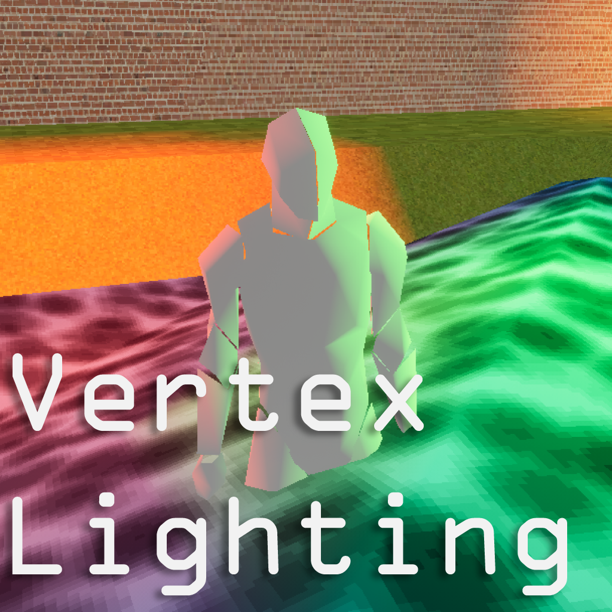
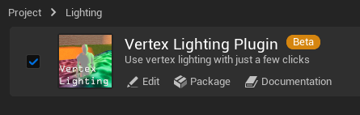
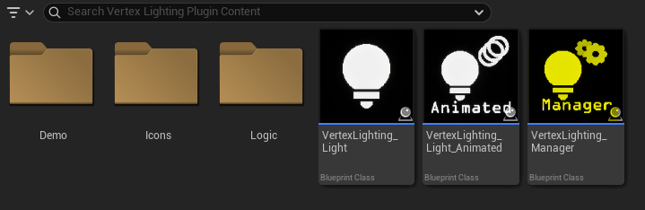
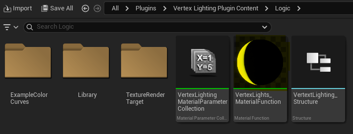
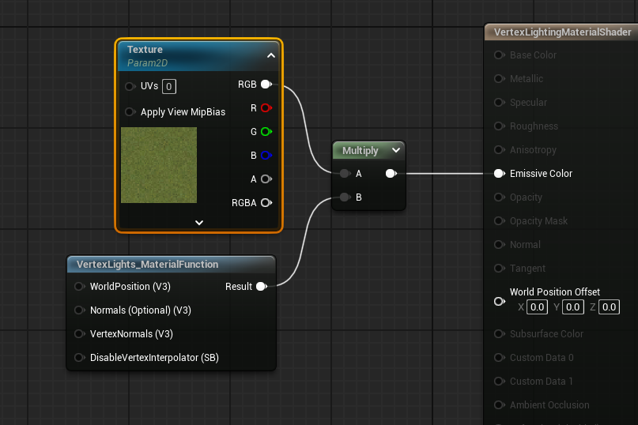
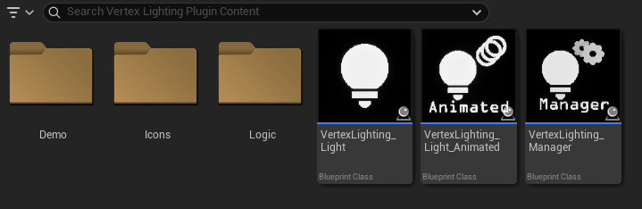
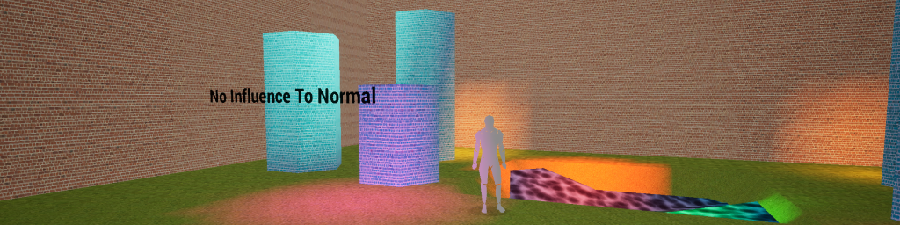
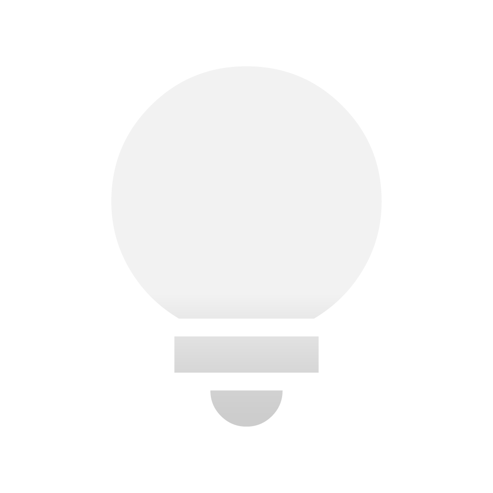

## How to Download and Install

1. **Download the Plugin**
   - Get the plugin from the GitHub Releases page or by downloading the source code.

2. **Install the Plugin**
   - Place the plugin folder into your project's `Plugins` directory. (Create a `Plugins` folder if it doesn't already exist.)

3. **Enable the Plugin**
   - The plugin should be enabled by default. However, double-check that it is enabled in the **Plugins** menu within Unreal Engine. 

---

## How to Use

1. **Set Up the Plugin**
   - In the Content Browser, navigate to the Vertex Lighting Plugin directory.
   - Drag and drop the `VertexLighting_Manager` into your level. 

2. **Configure Materials**
   - Locate the `VertexLights_MaterialFunction` in the Logic folder within the Vertex Lighting Plugin directory. 
   - Open the materials you want to use and multiply your base color/texture (Input A) with the `VertexLights_MaterialFunction` (Input B). 
   - Connect the result of the multiplication to the `Base Color` and/or `Emissive Color` of your material.

3. **Add Lights**
   - Place a `VertexLighting_Light` or `VertexLighting_Light_Animated` actor into your level to add lights. 

---

## Demo Level

The plugin includes a demo level showcasing multiple vertex lighting configurations. Experiment with the light settings to get a feel for their functionality and effects.

---

## Plugin Components

### **VertexLighting_Manager**
The `VertexLighting_Manager` is essential for vertex lighting functionality.
> [!IMPORTANT]
> Ensure only <ins>one</ins> manager is present per level.

> [!CAUTION]
> Only up to 256 vertex lights can be registered at the same time.

#### Default Settings:
- **Ambient Color**: Default environmental color.
  - *Default*: Hex sRGB - 7C7C7CFF | *Type*: Linear Color
- **SunNormalInfluence**: Controls how directional the vertex light sunlight should be, on a percentage basis. 0% makes the sunlight completely non-directional, while 100% makes it fully directional.
  - *Default*: 0% | *Type*: Float | *Range*: 0.0-100.0
- **ShowCombinedVertexLightInfo**: Enables debug information.
  - *Default*: True | *Type*: Boolean

#### Tick Rate:
- **Light Update Tickrate**: Time interval between light updates. Set to `0.0` to disable updates.
  - *Default*: 0.1s | *Type*: Float | *Range*: 0.0-Infinite

#### In-Editor Events:
- **Draw All Preview Lights**: Displays all vertex lights in the editor.
- **Unregister All Preview Lights**: Stops displaying vertex lights in the editor.

---

### **VertexLighting_Light**
The `VertexLighting_Light` adds a static or dynamic vertex light to your scene. 
> [!NOTE]
> `VertexLighting_Light` is not considered relevant for Level Bounds.

#### Default Settings:
- **Light Color**: Color of the light.
  - *Default*: Hex sRGB - FFFFFFFF | *Type*: Linear Color
> [!WARNING]
> Overridden by color curves for `VertexLighting_Light_Animated`.
- **Brightness**: Light intensity.
  - *Default*: 10x | *Type*: Float | *Range*: 0.0-100.0
> [!WARNING]
> Overridden by color curves for `VertexLighting_Light_Animated`.
- **Influence Radius**: Radius of the light's influence.
  - *Default*: 300cm | *Type*: Float | *Range*: 0.0-Infinite
- **Influence to Normal**: Controls how directional the vertex light should be, on a percentage basis. 0% makes the light completely non-directional, while 100% makes it fully directional.
  - *Default*: 0% | *Type*: Float | *Range*: 0.0-100.0
- **Render Distance**: Maximum render distance for the light.
  - *Default*: 10,000cm | *Type*: Float | *Range*: 0.0-10,000.0
- **Is Movable Light**: Makes the light's position dynamic during updates.
  - *Default*: False | *Type*: Boolean
- **Should Turn On In Range**: Determines if the light activates when the player is nearby.
  - *Default*: True | *Type*: Boolean

#### Editor Settings:
- **Show Render Distance**: Displays the render distance sphere in the editor.
  - *Default*: False | *Type*: Boolean

---

### **VertexLighting_Light_Animated**
The `VertexLighting_Light_Animated` adds a static or dynamic vertex light with a color curve to your scene.
> [!NOTE]
> The `VertexLighting_Light_Animated` inherits from `VertexLighting_Light`.

#### Animated Light Settings:
- **Color Curve**: Defines the color animation curve.
  - *Default*: "VertexLighting_ExampleColorCurve" | *Type*: Curve Linear Color
- **Start Position**: Starting point of the color curve.
  - *Default*: 0.0s | *Type*: Float
- **Start at Random Position**: Starts the curve at a random timestamp.
  - *Default*: False | *Type*: Boolean
- **Is Looping**: Determines if the animation repeats. If False, the light is destroyed after playback.
  - *Default*: True | *Type*: Boolean
- **Play Rate**: Speed of the animation playback.
  - *Default*: 100% | *Type*: Float
- **Should Update No Tick Rate**: Forces updates for animated lights even when tick rate updates are disabled.
  - *Default*: False | *Type*: Boolean

---

## Other Components

### **Color Curve**
`VertexLighting_Light_Animated` uses a color curve for its `Light Color` and `Brightness`

#### Color Channels:
- **R Channel**: Defines the red color
- **G Channel**: Defines the green color
- **B Channel**: Defines the blue color
- **A Channel**: Defines the brightness

---

## Troubleshooting

### **I can't see any vertex lights**
Ensure the following:
- A single `VertexLighting_Manager` is present in the level.
- You have placed `VertexLighting_Light` or `VertexLighting_Light_Animated` actors in your level instead of regular lights.
- The `VertexLights_MaterialFunction` is properly multiplied with your material's texture.
- The model has sufficient vertices within the light's influence range. Vertex lights only illuminate vertices, so ensure your model has enough for visible effects.
